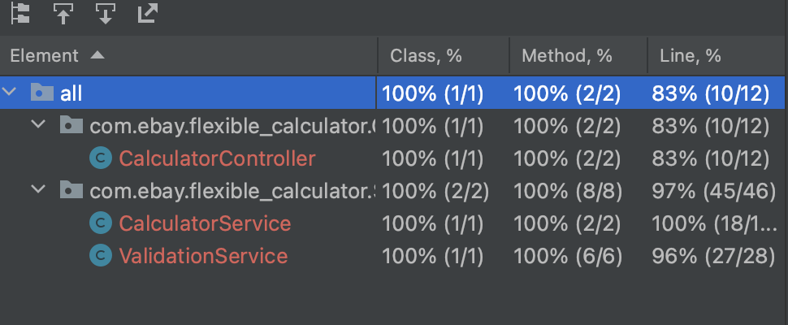

# Extensible Calculator in Java
## Objective
The goal of this project is to implement a simple and extensible calculator in Java that adheres to object-oriented design principles, particularly the Open-Closed Principle (OCP). The calculator is designed with maintainability and extensibility in mind, allowing for new operations to be added easily without modifying the existing code.

## Features
Basic Operations:

The calculator supports basic arithmetic operations such as ADD, SUBTRACT, MULTIPLY, and DIVIDE, which are defined in an Operation enum.
## Single Calculation Method:

A calculate method in the Calculator class takes in two numbers and an operation, and returns the result of the operation.

**POST** `/api/v1/calculator/calculate`

**Request Body:**

```json
{ "operation": "ADD", "num1": 2, "num2": 3 }
```

**Response:**

```json
{ "result": 5.0 }
```
## Chaining Operations:

The calculator allows users to chain multiple operations on a single initial value, making it behave like a basic calculator. This enables performing multiple operations in sequence.
**POST** `/api/v1/calculator/chain`

**Request Body:**

```json
{ "initialVal": 0 , [ {"operation": "ADD", "num": 3}, {"operation": "MULTIPLY", "num": 2} ] }
```

**Response:**

```json
{ "result": 6.0 }
```
## Extensibility:

The calculator is designed to be extensible, meaning new operations can be added by defining new constants in the Operation enum, without changing the core logic of the calculator.
IoC (Inversion of Control) Compatibility:

The design is compatible with an IoC environment (e.g., Spring Framework), making it easier to manage dependencies and enable unit testing with dependency injection.
Error Handling:

The solution handles invalid inputs (e.g., null operations, division by zero) gracefully by throwing appropriate exceptions such as IllegalArgumentException or UnsupportedOperationException.

## Requirements
Java: JDK 8 or higher
Maven: For building and managing dependencies (optional)
JUnit 5: For unit testing

## Installation and Setup

**Clone the Repository**

```bash
git clone https://github.com/y1zhuo/Flexible-Calculator.git

cd Flexible-Calculator
```

**Build the Project**

```bash
mvn clean install
```

**Run the Application**

```bash
mvn spring-boot
```

**Access the API**

The API will be available at `http://localhost:9090/api/v1/calculator`.

## Testing

Unit tests are written using JUnit 5 and Mockito to test both valid and edge cases. These include:

Validating basic operations such as ADD, SUBTRACT, MULTIPLY, and DIVIDE.
Ensuring that division by zero throws an appropriate exception.
Verifying that chaining operations work as expected.
Testing error handling for null inputs, unsupported operations, and invalid operations.


## Future Improvements
**Additional Operations:** Support for more advanced operations like modulo, exponentiation, etc.
**Enhanced Error Handling:** More detailed exception messages and custom error codes.
**Logging:** Add structured logging for better traceability.
**Performance Optimization:** Improve performance for handling large numbers or complex calculations.
## Conclusion
This project demonstrates how to build an extensible calculator in Java while adhering to key object-oriented principles like the Open-Closed Principle. The design allows for easy addition of new operations, robust error handling, and the ability to handle chained operations. The inclusion of IoC compatibility and extensive unit testing ensures that the solution is maintainable and testable in any environment.
